# Project 2 - Operationalizing Machine Learning

This project aims to automate the Machine Learning process going through the model selection, deployment, and consumption using an HTTP API. The dataset provided contains information about a bank marketing campaign and indicates if a customer subscribed to a fixed-term deposit. The model we aim to develop should predict the customer will or won't subscribe to this term. At the end of the project, we create and deploy a Pipeline with the experiment steps that can be consumed through an HTTP endpoint, and we test it..

## Architectural Diagram

0. Authentication
   - Creation of service principal to access the workspace used in the project
1. Dataset register
2. Automated ML to choose the best model
   - Input: the dataset, target column, type of ML task (classification)
   - Create a compute cluster and send the experiment there
   - Using of Automated ML to determine the best model
   - Output: best ML model
3. Best model Deployment
   - Input: best model, container
   - Output: best model endpoint (allows interaction with HTTP API service)
   - In this step, we select the best model from the automated ML run and deploy it. This process creates an HTTP service for the model, allowing interaction with it using POST requests.
4. Logging
   - Input: python script (logs.py) + config.json + deployment name
   - Output: application insights on
   - In this step, we update the best model service to allow using the App Insights tool. 
5. Swagger Documentation
   - Input: swagger.json w/ best model endpoint data + docker port mapped to localhost port + python server exposing swagger.json
   - Output: local web app w/ automated documentation about the best model endpoint API
   - In this step, we create a swagger local service and deploy the documentation of the best model created in step 3. The AzureML platform already provides the swagger.json file that can be consumed by the Swagger web app.
6. Model endpoints consumption
   - Inputs: python script (endpoint.py) w/ example new data for prediction + scoring URI (URI of our best model) + authentication primary key
   - Output: data.json + API response
   - In this step, we send two entities of data for our best model using a python script that interacts with the HTTP API deployed before. Our model sends its prediction as a response and this is printed at the end of the script.
7. Benchmarking the API
   - Input: benchmark.sh + coring URI (URI of our best model) + authentication primary key
   - Output: performance results
   - Here we use Apache Benchmarking to test the performance of our model and understand if it is satisfactory. For this, we send 10 requests of prediction and measure the meantime that the API took to respond.
8. Creating and publishing the pipeline
   - Input: Python notebook + experiment name + cluster name + dataset
   - Output: published pipeline endpoint (HTTP API)
   - In this step, we use the python notebook provided in the exercise to create and publish a pipeline with the experiment done in this project. The pipeline consists of using the Bank marketing dataset as input to the Automated ML step that will have the best model as output. The 
9. Interacting with the pipeline
   - Input: published pipeline + authentication header
   - Output: pipeline run status + best model
   - In this step, we create an authentication header and send an HTTP post request to our pipeline endpoint and follow up the run using the Run Details widget provided by Python SDK.

## Key Steps
0. Authentication (skipped due to lack of permission)
   - Creation of service principal to access the workspace used in the project

1. Dataset register
   - Inclusion of the Bank marketing dataset in Azure ML data storage
   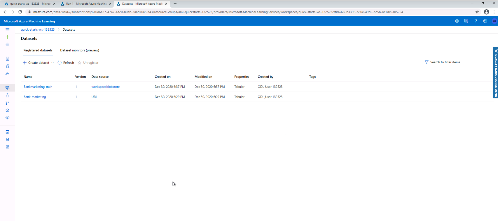

2. Automated ML to choose the best model
   - Creation a compute cluster to run the experiment
   - Using of Automated ML to determine the best model
   - AutoML Completed Experiment:
   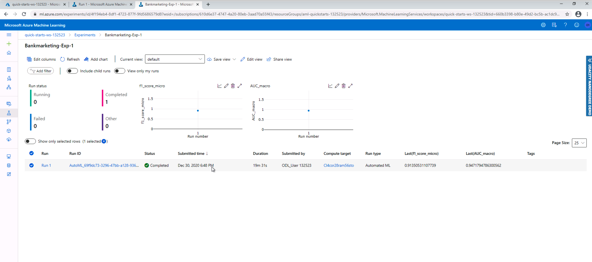
   - Best model detected by AutoML:
   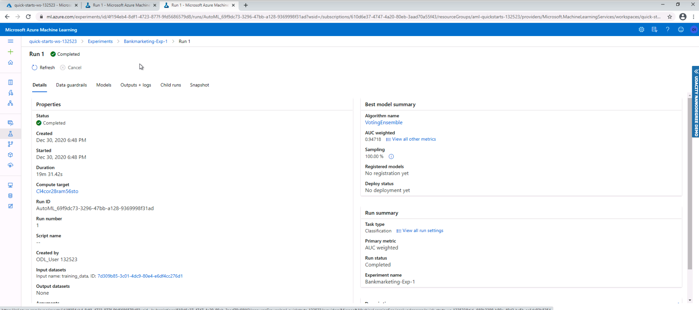

3. Best model Deployment
   - In this step, we select the best model from the automated ML run and deploy it. This process creates an HTTP service for the model, allowing interaction with it using POST requests.

4. Logging
   - In this step, we update the best model service to allow using the App Insights tool. 
   - Best model endpoint with Application Insights Enabled:
   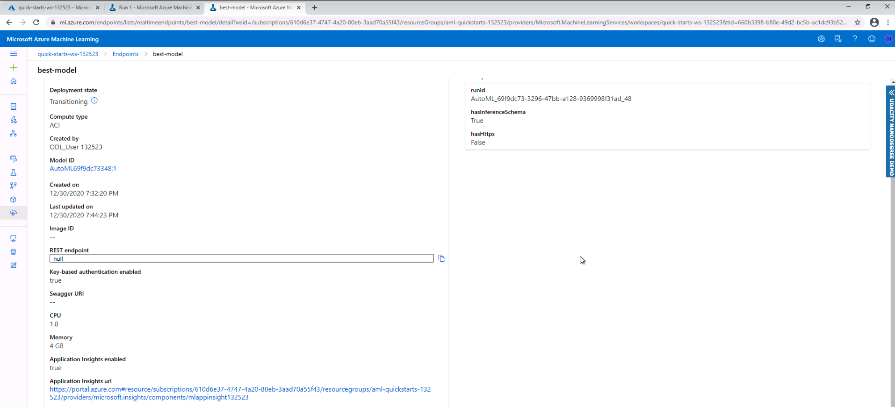
   - Logs printed by the python script logs.py:
   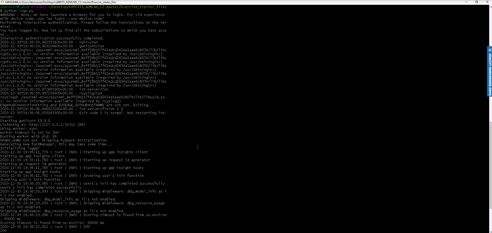
   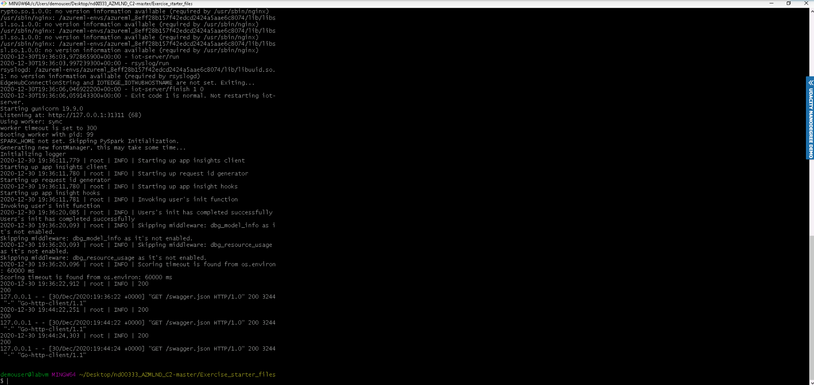

5. Swagger Documentation
   - Input: swagger.json w/ best model endpoint data + docker port mapped to localhost port + python server exposing swagger.json
   - Output: local web app w/ automated documentation about the best model endpoint API
   - In this step, we create a swagger local service and deploy the documentation of the best model created in step 3. The AzureML platform already provides the swagger.json file that can be consumed by the Swagger web app.
   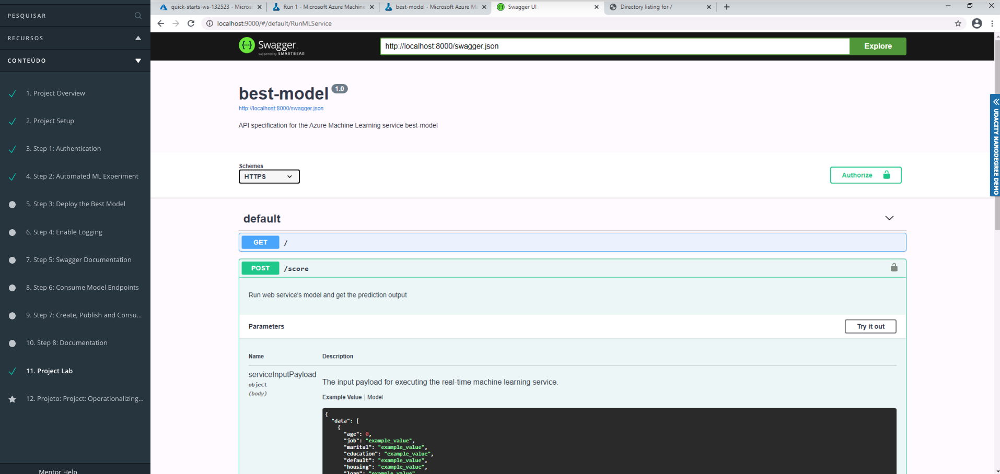
6. Model endpoints consumption
   - Inputs: python script (endpoint.py) w/ example new data for prediction + scoring URI (URI of our best model) + authentication primary key
   - Output: data.json + API response
   - In this step, we send two entities of data for our best model using a python script that interacts with the HTTP API deployed before. Our model sends its prediction as a response and this is printed at the end of the script.
   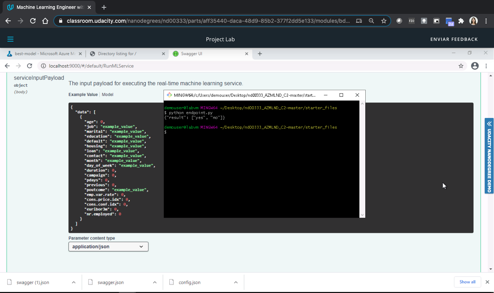
7. Benchmarking the API
   - Input: benchmark.sh + coring URI (URI of our best model) + authentication primary key
   - Output: performance results
   - Here we use Apache Benchmarking to test the performance of our model and understand if it is satisfactory. For this, we send 10 requests of prediction and measure the meantime that the API took to respond.
   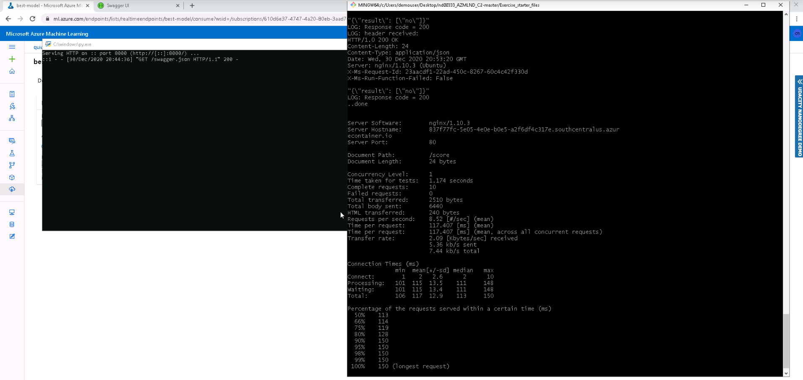
8. Creating and publishing the pipeline
   - Input: Python notebook + experiment name + cluster name + dataset
   - Output: published pipeline endpoint (HTTP API)
   - In this step, we use the python notebook provided in the exercise to create and publish a pipeline with the experiment done in this project. The pipeline consists of using the Bank marketing dataset as input to the Automated ML step that will have the best model as output. The 
9. Interacting with the pipeline
   - Input: published pipeline + authentication header
   - Output: pipeline run status + best model
   - In this step, we create an authentication header and send an HTTP post request to our pipeline endpoint and follow up the run using the Run Details widget provided by Python SDK.
   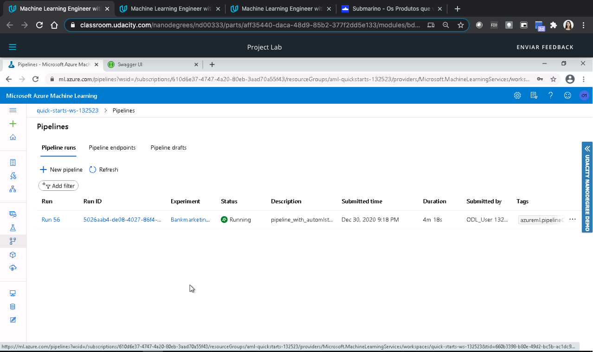
   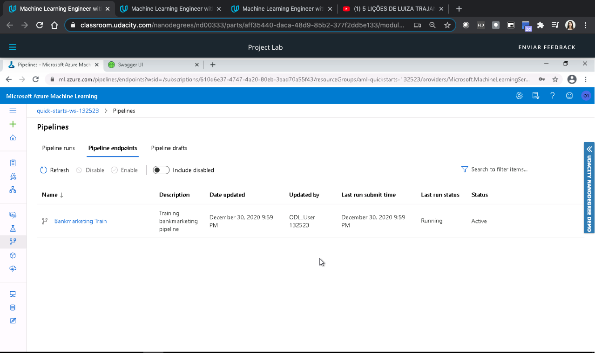
   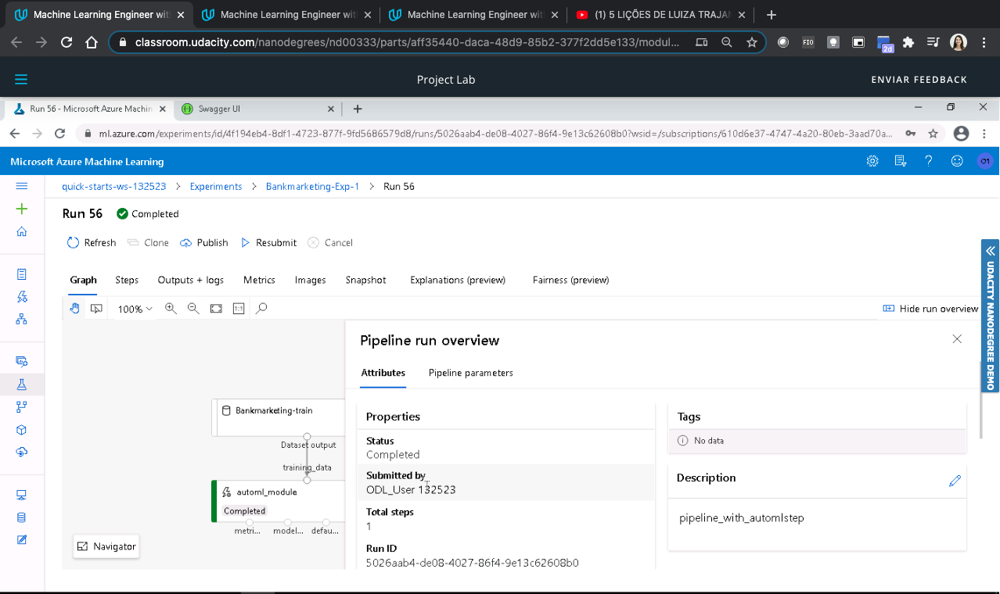
   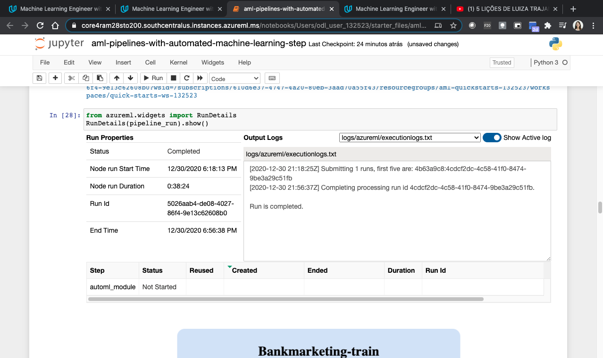
   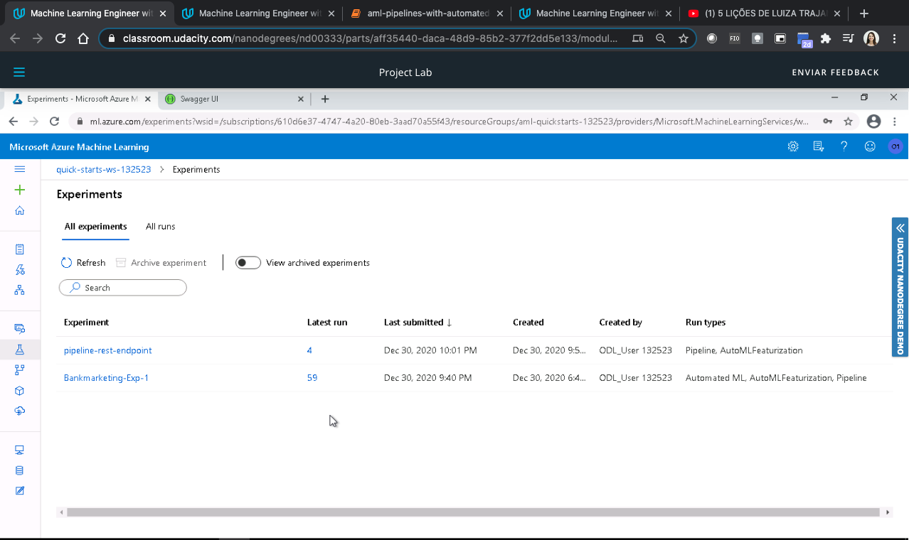
   

## Screen Recording
https://drive.google.com/file/d/1wXqG1fZY4yle9QWnFukgQk0VYMMXfVIS/view?usp=sharing

