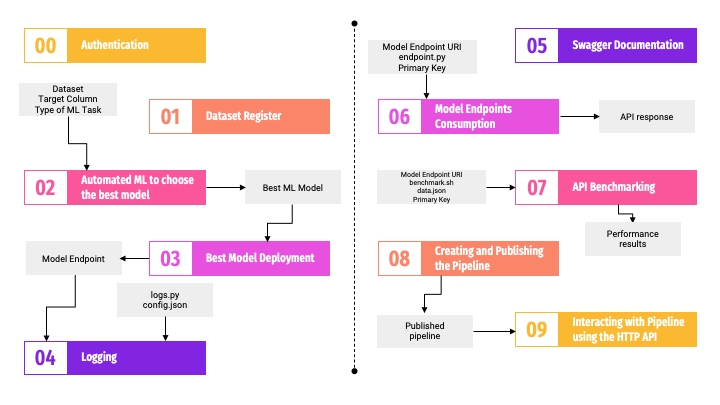
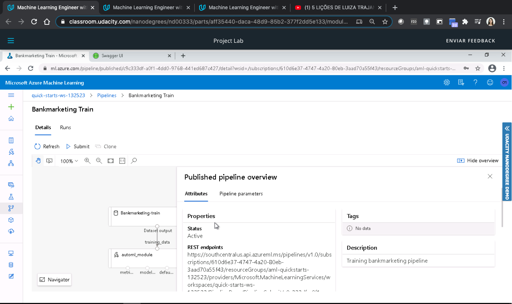

# Machine Learning Engineer with Microsoft Azure
## Project 2 - Operationalizing Machine Learning
### Clarisse Simoes Ribeiro - December 2020

This project aims to automate the Machine Learning process going through the AutoML, deployment, and consumption using an HTTP API.

The dataset provided contains information about a bank marketing campaign and indicates if a customer subscribed to a fixed-term deposit. The model we aim to develop should predict the customer will or won't subscribe to this term. For this, we use AutoML to test many different algorithms. The best model is deployed in an Azure Container Instance w/ authentication, becoming an endpoint, which can be accessed through an HTTP API.

Azure provides an enhanced view of the logs with Applications Insights. It is possible to monitor how the best model endpoint is responding using a variety of graphics created by this tool. In this project, we enable Application insights using the Python SDK.

Furthermore, Azure also provides the Swagger JSON for the model endpoint. In this project, we also explore the automated documentation for the best model endpoint by creating a Swagger service and loading JSON provided by Azure in it.

Up to this point, the entire process is manual using the Azure ML Platform. All the steps can be automated using the Python SDK. This is done at the end of the project, where we create and deploy a Pipeline with the experiment steps that can be consumed through an HTTP endpoint. We also test the pipeline API by sending an HTTP POST request for it at the end of the Python notebook. Finaly, we can monitor the run using the Run Details widget.

## Architectural Diagram
   

## Possible improvements to this project in the future

In this project, the focus is not on the model itself, but mostly on the automation provided by the Azure ML Platform and the Python SDK. This leaves space for improvements in the model itself.

We can improve the best model chosen by Automated ML by reviewing the performance metrics provided by Azure. It is possible to review the data that is not getting predicted right and understanding what is going on. Azure provides Pipeline steps to enable data transformation and feature selection that could be used there to create or exclude columns of the table, cleaning missing data, filtering the data, and so on and so forth.

After the model is deployed and starts being used in production, we can follow up on Application Insights metrics to understand if our cluster configuration is handling requests with an acceptable runtime performance.

## Key Steps
### Authentication (skipped due to lack of permission)
Creation of service principal to access the workspace used in the project

### Dataset register
Inclusion of the Bank marketing dataset in Azure ML data storage
   

### Automated ML to choose the best model
In this step we create a compute cluster to run the experiment and use Automated ML to determine the best model.
   #### AutoML Completed Experiment:
   
   #### Best model detected by AutoML:
   

### Best model Deployment
In this step, we select the best model from the automated ML run and deploy it. This process creates an HTTP service for the model, allowing interaction with it using POST requests.

### Logging
In this step, we update the best model service to allow using the App Insights tool. 
   #### Best model endpoint with Application Insights Enabled:
   
   #### Logs printed by the python script logs.py:
   
   

### Swagger Documentation
In this step, we create a swagger local service and deploy the documentation of the best model created in step 3. The AzureML platform already provides the swagger.json file that can be consumed by the Swagger web app.
   #### Swagger Web App showing the HTTP API methods and responses for the deployed model:
   

### Model endpoints consumption
In this step, we send two entities of data for our best model using a python script that interacts with the HTTP API deployed before. Our model sends its prediction as a response and this is printed at the end of the script.
   #### Response of model endpoint:
   

### Benchmarking the API
Here we use Apache Benchmarking to test the performance of our model and understand if it is satisfactory. For this, we send 10 requests of prediction and measure the meantime that the API took to respond.
   #### Apache Benchmarking output with the performance of our API:
   

### Creating and publishing the pipeline
In this step, we use the python notebook provided in the exercise to create and publish a pipeline with the experiment done in this project. The pipeline consists of using the Bank marketing dataset as input to the Automated ML step that will have the best model as output. 
   #### Pipeline created in Pipeline section of AzureML Platform:
   
   #### Active Pipeline Endpoint:
   
   #### Pipeline view with the Bank Marketing dataset and the AutoML step:
   
   #### The “Published Pipeline overview”, showing a REST endpoint and a status of ACTIVE:
   

### Interacting with the pipeline
In this step, we create an authentication header and send an HTTP post request to our pipeline endpoint and follow up the run using the Run Details widget provided by Python SDK.
   #### Widget to get run details in Jupyter Notebook:
   
   #### Scheduled run ("pipeline-rest-endpoint") coming from the Pipeline:
   
   

## Screen Recording Link
https://drive.google.com/file/d/1VdTOuidCTVDw6KnjvbK3dzwnin7M3iLV/view?usp=sharing